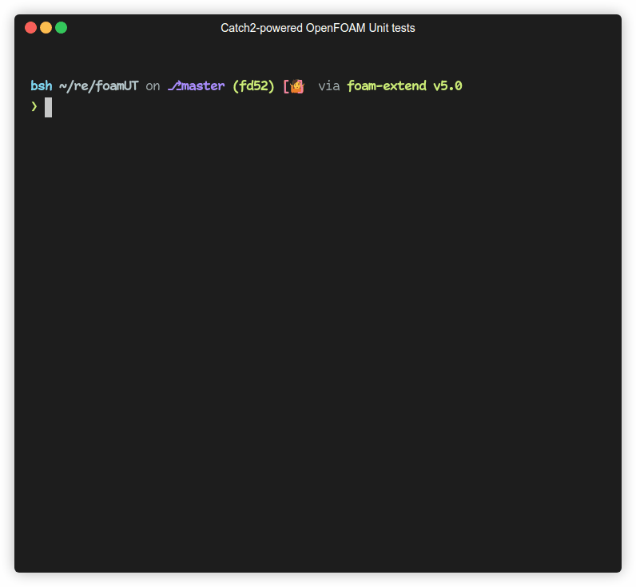

# A unit/integration testing framework for OpenFOAM code

> This offering is not approved or endorsed by OpenCFD Limited,
> the producer of the OpenFOAM software and owner of the OPENFOAM® and OpenCFD® trade marks.

This is a unit/integration testing framework to help test-proof new OpenFOAM code
(might be too late for the OpenFOAM library itself). This repository will always work with the
latest versions of the main three OpenFOAM forks: [ESI OpenCFD's](https://openfoam.com),
[Foundation version](https://openfoam.org) and
[Foam-Extend](https://sourceforge.net/projects/foam-extend/files/).

If you intend to write cross-forks code, this can help you maintain your sanity. You can
just keep branches for each fork on your code's repository and invoke CI on them with the
help of this testing framework.

## A quick demo



## How to use this repo

The [Alltest](Alltest) script loops through the [OpenFOAM cases](cases) and runs corresponding
test cases (for directories it finds under [tests](tests) that contain a `Make` folder)
- both in serial and in parallel.

You can use this to your advantage as you don't need to include this repo into your code base:

1. In your library's repo, write tests the way you like;
   ship them with their own `Make` directory to compile the test driver (see [example tests](tests/exampleTests))
1. Set the `FOAM_FOAMUT` environment variable to your local clone of `foamUT` repository
1. In your CI workflows, checkout this repository, set `FOAM_FOAMUT` to its path, and either:
    - symlink your tests somewhere under `tests`
      ```bash
      ln -s /path/to/your/tests/myLibTests tests/myLibTests
      ```
    - or set `FOAM_FOAMUT_TESTS` to your `tests` folder
      ```bash
      export FOAM_FOAMUT_TESTS=/path/to/your/tests
      ```
1. Do the same for your OpenFOAM cases if you have any (only a simple cavity case is provided by default).
   Put these under `cases`.
1. Run `./Alltest` to compile and run your tests on your cases.

## Documentation

Head to the [wiki](https://github.com/FoamScience/foamUT/wiki)
to read few more words about this framework. There is also a FAQ there.

## Contributing

Ease of use and portability across OpenFOAM forks are the main focus of this framework.
As long as your contribution doesn't hinder one of those two objectives; it will be welcomed!
And PRs against master are the way to go.
